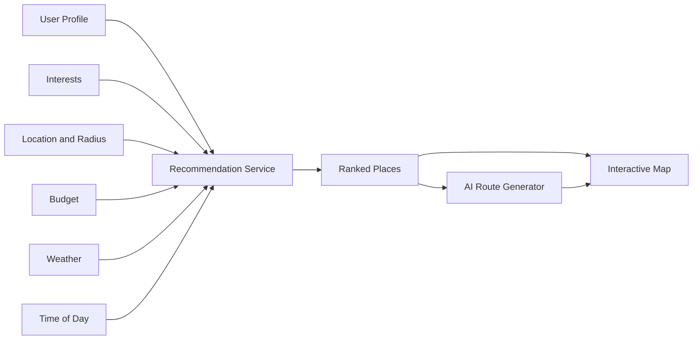
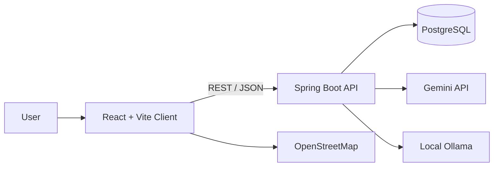

<div align="center">

# Travel Assistant

A personalized travel recommendation platform with interactive maps and AI-assisted route generation.


</div>

## Overview

Travel Assistant is a full-stack web application that recommends nearby places and generates personalized travel routes. Recommendations take into account the user's profile, interests, location, walking radius, budget, weather conditions and time of day.

The project combines a Spring Boot REST API with a React client, PostgreSQL persistence, OpenStreetMap-based visualization and optional AI providers for route generation.

## Key Features

- User registration and JWT-based authentication
- Personal profile with city, preferences and walking radius
- User interests with configurable importance
- Browser geolocation support
- Interactive map built with React Leaflet and OpenStreetMap
- Nearby place recommendations and detailed place information
- Recommendation scoring based on interests, budget and context
- Weather-aware recommendations
- Time-of-day-aware recommendations
- AI-assisted route generation
- Generated routes displayed on the map and profile page
- Gemini API integration
- Local Ollama integration
- Multilingual user interface
- Light and dark theme support

## How Recommendations Work



## Architecture



## Tech Stack

### Backend

- Java 17
- Spring Boot 4.0
- Spring Web / REST API
- Spring Data JPA and Hibernate
- Spring Security
- JWT authentication
- Bean Validation
- PostgreSQL
- Maven
- Lombok

### Frontend

- React
- Vite
- React Router
- Axios
- React Leaflet
- OpenStreetMap
- Browser Geolocation API
- JavaScript and CSS

### AI and External Services

- Google Gemini API
- Ollama with a locally hosted model
- Weather data used in recommendation logic
- Map and geographic data from OpenStreetMap

## Project Structure

```text
Tourist-assistant/
├── src/main/java/                 # Spring Boot backend
├── src/main/resources/            # Database, JWT and AI configuration
├── travel-assistant-frontend/
│   └── src/
│       ├── api/                   # Axios client
│       ├── pages/                 # Login, profile, map and route pages
│       ├── components/            # Reusable UI components
│       └── ...
├── pom.xml
└── README.md
```

## Getting Started

### Requirements

- JDK 17
- Maven 3.9+
- Node.js 18+
- PostgreSQL
- Optional: Ollama
- Optional: Google Gemini API key

### 1. Clone the repository

```bash
git clone https://github.com/Alexsh206/Tourist-assistant.git
cd Tourist-assistant
```

### 2. Prepare PostgreSQL

Create a database named:

```text
travel_assistant
```

Update your local database credentials in:

```text
src/main/resources/application.yml
```

### 3. Configure AI providers

For Gemini, define the environment variable:

```bash
GEMINI_API_KEY=your_api_key
```

For local AI route generation, start Ollama and make sure the configured model is available. The current local configuration expects Ollama at:

```text
http://localhost:11434
```

The application can be adapted to use either Gemini or a local Ollama model.

### 4. Run the backend

```bash
mvn spring-boot:run
```

The backend starts at:

```text
http://localhost:8080
```

### 5. Run the frontend

```bash
cd travel-assistant-frontend
npm install
npm run dev
```

Open the address printed by Vite in the terminal.

## Security and Configuration

The committed configuration is intended for local development. Before deployment:

- move the database password and JWT secret to environment variables;
- never commit API keys;
- disable verbose Spring Security logging;
- configure trusted CORS origins;
- use separate development and production profiles.

## Project Status

The main user flow, map interface, contextual recommendations and AI route generation are implemented. Planned improvements include automated tests, interaction-based recommendation learning, caching, Docker Compose, API documentation and cloud deployment.

## Author

**Oleksii Shaidiuk**  
Java Backend Developer  
[GitHub](https://github.com/Alexsh206) · [LinkedIn](https://www.linkedin.com/in/%D0%BE%D0%BB%D0%B5%D0%BA%D1%81%D1%96%D0%B9-%D1%88%D0%B0%D0%B9%D0%B4%D1%8E%D0%BA-2531a6329/)
